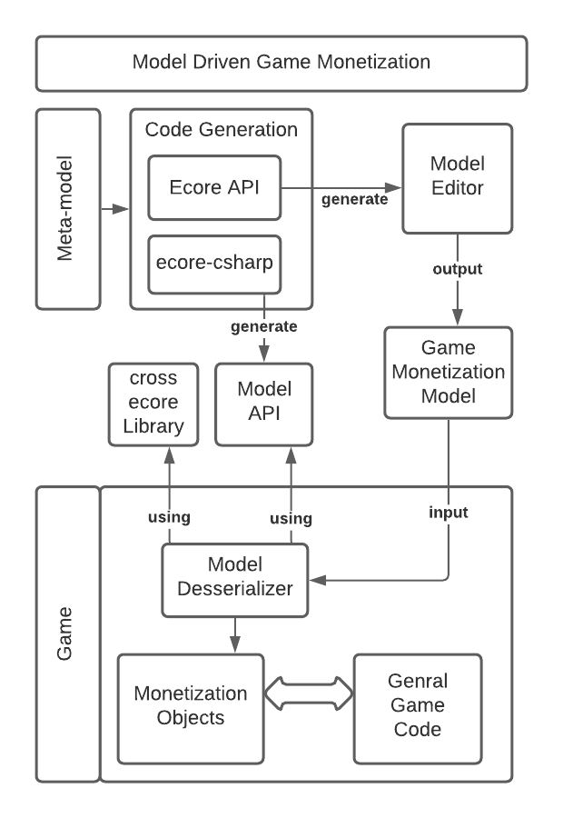

# meta-f2p

In this project you will find the necessary resources to apply use model driven approach for game monetization.
Meta-F2P is a domain specific modeling language used to design free-to-play games' monetization.
It is represented as an ecore meta-model that contains the necessary rules and elements to specify how a game will be monetized base on a set of common monetization strategies.

Here you will find the following:
 - Figures of game monetization models

##IMPORTANT NOTES
- Fix for XMI Error: eet Unity to .NET4 in Edit>Project Settings>Player>API Compatibility Level 
- Plugin for visualizing instantiated models as class diagrams http://dynamicgmf.sourceforge.net/
